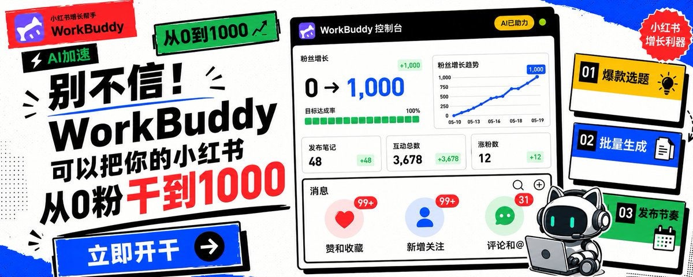
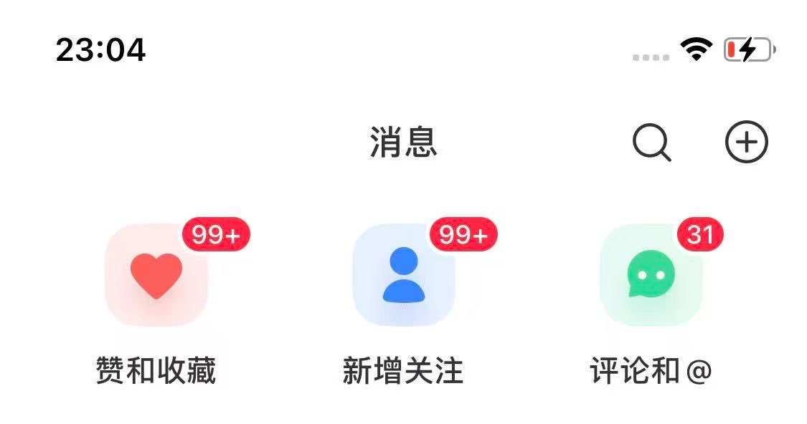
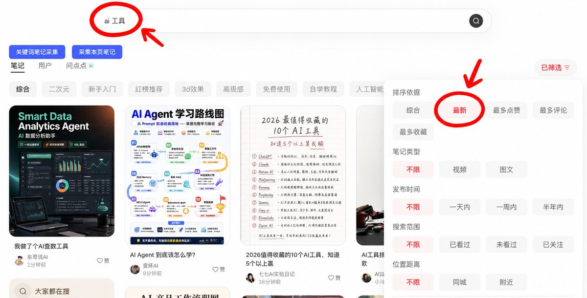

# AI Skills 创作小店 · 小红书运营技能套件



> 让 Agent 帮你跑完整套小红书冷启动：从定位、选题、改稿、图文规划，到发布排期和数据复盘。

**来源：** gyc567/wenzi-xhs-agent-skills（基于文子《WorkBuddy小红书从0到1000》方法论重写）
**品牌：** AI Skills 创作小店（已获授权改造并商业化）

这不是"再写一篇小红书文案"的提示词合集，而是一套可以安装到 **Codex / Claude** 的内容运营工作流。

你只需要告诉 Agent：

```
我想做一个面向职场新人的 AI 工具号，未来通过咨询变现。
请带我从定位开始，建立账号档案，并规划前 10 条内容。
```

它会依次帮你交付：

1. 一句话账号定位与变现路径
2. 可长期复用的账号档案
3. 低粉高数据样本拆解
4. 35+ 个结构化选题与标题
5. 前 10 条及 30 天发布计划
6. 单篇内容的人味化改稿与 6–8 页图文结构
7. 每周数据复盘与下一轮实验

## 真实结果不是口号

这套方法来自真实的小红书内容实践。下面展示的是过往阅读与互动结果，用来说明工作流经过实际运营验证；每个账号的基础、选题和执行情况不同，因此这些案例不代表对粉丝数或流量的承诺。

<p align="center">
  
  
</p>

## 60 秒开始

### 安装

复制 6 个 Skill 目录到 Codex：

```bash
cp -R xhs-* ~/.codex/skills/
```

Claude Code 用户可复制到：

```bash
cp -R xhs-* ~/.claude/skills/
```

完成后重启对应应用。

### 直接说人话，不必记 Skill 名

**从零起号**

```
我想做小红书，但还不知道定位和变现方式。请先帮我盘点优势和可售卖资产，再规划前 10 条内容。
```

**已有账号重新梳理**

```
这是我过去发布的内容和数据。请判断定位是否需要收敛，并给出下一轮 10 条内容的测试计划。
```

**单篇内容优化**

```
这篇初稿 AI 味太重。请保留我的真实观点，把它改成能直接发布的小红书文案，并拆成 8 页图文结构。
```

## 它不是一次性写作工具

```
变现倒推定位
→ 建立账号档案
→ 规划前 10 条系统画像内容
→ 生成选题库和标题
→ 校准初稿与图文结构
→ 学习低粉高数据样本
→ 用 10–20 条数据复盘定位
→ 把结论写回账号档案
```

每一轮发布都会留下数据和结论，成为下一轮内容的输入。目标不是让 AI 替你批量生产"营销号文案"，而是逐步建立一套更像你、也更懂你账号的内容系统。

## 6 个 Skills

| 你现在的问题 | Skill | 核心交付 |
|---|---|---|
| 不知道做什么账号，也不知道未来卖什么 | `xhs-monetization-pro` | 变现路径、定位卡、内容矩阵、10–20 条验证计划 |
| 每次让 AI 写内容，都不像你本人 | `xhs-account-profile` | 账号档案、语言样本、可信主张、内容与视觉边界 |
| 想拆低粉高数据样本为什么有效 | `xhs-viral-pattern` | 样本筛选、点击/停留/互动诊断、可迁移结构 |
| 缺选题、标题和封面钩子 | `xhs-topic-generator` | 35+ 选题、标题公式、封面方向、发布优先级 |
| 初稿太顺、太空、太像模板 | `xhs-humanize-editor` | AI 味诊断、真人化改稿、发布检查、图文拆页 |
| 不知道前 10 条怎么发，或发完不会复盘 | `xhs-schedule-review` | 发布排期、数据看板、定位复盘、下周实验 |

## 三种推荐工作流

### 从 0 开始做新号

```
xhs-monetization-pro
→ xhs-account-profile
→ xhs-schedule-review
→ xhs-topic-generator
→ xhs-humanize-editor
→ xhs-viral-pattern
→ xhs-schedule-review
```

### 已有账号重新梳理

```
xhs-schedule-review
→ xhs-monetization-pro
→ xhs-account-profile
→ xhs-viral-pattern
→ xhs-topic-generator
```

### 单篇内容优化

```
xhs-topic-generator
→ xhs-humanize-editor
→ xhs-viral-pattern
```

## 设计原则

### 先定商业方向，再做内容

没有清楚的目标用户、信任资产和 offer，选题越多越容易把账号做散。定位 Skill 会先回答：谁为什么需要你、为什么相信你、内容如何承接下一步关系。

### 学结构，不复制表达

优先分析近期、低粉、高数据的样本，拆解封面承诺、标题、开头、正文结构、收藏理由和评论动机。迁移的是内容机制，不是原文。



*示例：搜索垂直关键词并切换到"最新"，从近期内容里寻找可分析的真实样本。*

### 真人感来自证据，不是口语词

"去 AI 味"不只是把句子写得随意，而是加入真实经历、具体场景、踩坑、数据、对话和前后变化。

### 用一轮数据修正定位

前 10–20 条是验证期，不因为一篇数据高就立刻复制，也不因为三篇数据低就过早放弃。每周把结论写回账号档案，再决定下一轮测试什么。

## 项目结构

```
.
├── README.md              ← 本文件
├── xhs-monetization-pro/ ← 变现倒推定位
├── xhs-schedule-review/  ← 发布排期与复盘
├── xhs-account-profile/  ← 账号档案
├── xhs-humanize-editor/  ← AI人味化改稿
├── xhs-viral-pattern/    ← 低粉爆款拆解
└── xhs-topic-generator/  ← 选题库生成
```

每个 Skill 目录包含：

- `SKILL.md`：Agent 可调用的技能说明

## 品牌说明

**本仓库为 AI Skills 创作小店改造版本**

- 原项目：gyc567/wenzi-xhs-agent-skills（基于文子方法论）
- 改造品牌：AI Skills 创作小店
- 已签署双协议，商业化授权

## 方法来源

- 文子 X Article《别不信！WorkBuddy 就可以把你的小红书从 0 粉干到 1000》
- yanliudreamer 小红书系列中的起号、个人 IP、内容验证和长期增长方法
- dontbesilent2025/dbskill 中的小红书标题、内容诊断、对标、共鸣、开头、文风和复盘模块
- ziguishian/xhs-visual-director-skill 中的图文内容视觉导演方法

## 使用边界

- Skill 提供的是内容运营方法和决策支持，不保证粉丝数、流量或变现结果。
- 平台规则、推荐机制和工具能力会变化，发布前仍应结合当前规则核验。
- "养号""特定设备流量更好"等缺少稳定证据的说法没有被写入执行流程。
- 拆解对标内容时只学习结构、机制和用户需求，不复制原文或侵犯他人权益。
